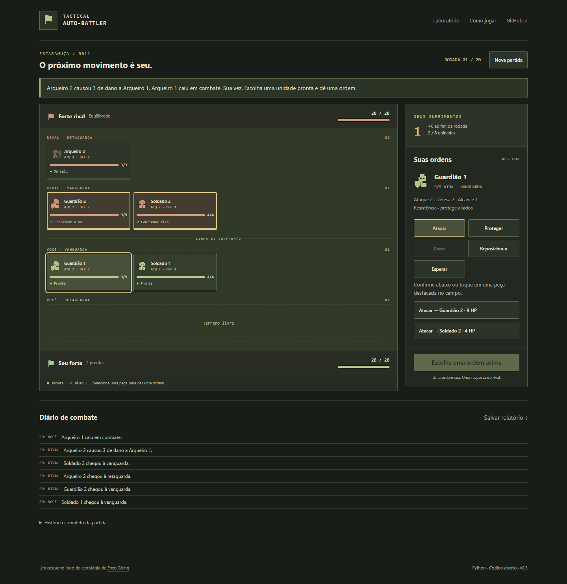
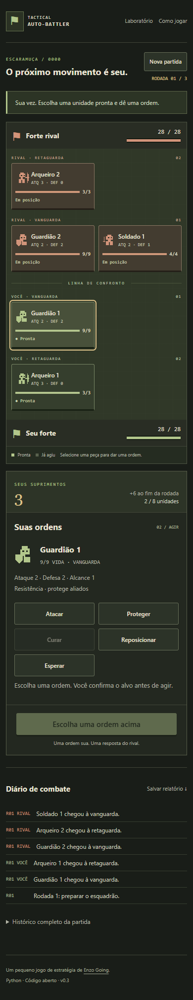

# Tactical Auto-Battler

[](https://github.com/enzo-going/tactical-autobattler-python/actions/workflows/tests.yml)
[](https://github.com/enzo-going/tactical-autobattler-python/actions/workflows/pages.yml)

Um pequeno jogo tático em turnos feito em Python. Recrute um esquadrão, escolha
a ação de cada unidade e abra caminho até o forte adversário.

**[Jogar no navegador](https://enzo-going.github.io/tactical-autobattler-python/)** ·
[Laboratório de simulação](https://enzo-going.github.io/tactical-autobattler-python/simulator.html) ·
[A transição para a fase II](docs/phase-two.md)

> A versão publicada acompanha `main`. Mudanças em uma branch/PR só aparecem
> no site após merge e conclusão do workflow Pages. Para testar uma branch,
> siga as instruções locais abaixo.



## Capítulo II — sob seu comando

Na versão 0.2, a interface calculava a partida inteira e apresentava um replay.
O jogador escolhia duas estratégias e assistia. A versão **0.3** retoma a ideia
de um jogo por turnos: a partida existe como uma sessão em Python e espera por
uma ordem a cada decisão. Nenhum cronômetro avança o campo.

| Antes: simulador | Agora: modo principal |
| --- | --- |
| Escolher dois bots | Comandar um esquadrão contra um bot |
| Assistir à sequência pronta | Escolher unidade, ação e alvo |
| Recrutamento automático | Comprar reforços e decidir a linha |
| Cura e proteção automáticas | Decidir quando atacar, curar ou proteger |
| Play, pause e velocidade | Preparação, ações alternadas e revisão |
| Relatório de uma simulação | Histórico de comandos e estado da partida |

O laboratório continua disponível com simulações, replays, torneios e regras
da fase anterior. O jogo interativo tem regras próprias de alternância e avanço
de linha; resultados dos dois modos não medem o mesmo balanceamento.

A [documentação da fase II](docs/phase-two.md) registra decisões de arquitetura,
diferenças de regras, contrato de comandos e processo de migração.

## Como jogar

1. **Prepare.** Comece com 10 suprimentos e recrute até 8 unidades. Escolha a
   vanguarda ou a retaguarda, ou mantenha a posição recomendada.
2. **Dê ordens.** Entre em combate, selecione uma unidade pronta, escolha uma
   ação e confirme o alvo. O rival responde com uma unidade. Cada peça age
   uma vez por rodada, inclusive os recrutas recém-chegados.
3. **Reorganize.** Quando todas as unidades agirem, confira o resultado da
   rodada. Se a partida continuar, ambos recebem 6 suprimentos e o jogo espera
   você avançar.
4. **Vença.** Elimine as tropas para atacar o forte rival. Destruir a base vence
   a partida. No limite de rodadas, vence a base com mais vida; em igualdade,
   conta o dano de golpes causado (sem sangramento). Persistindo a igualdade,
   há empate.

| Unidade | Custo | O que oferece |
| --- | ---: | --- |
| Soldado | 2 | Linha de frente barata |
| Arqueiro | 3 | Alcança as duas linhas e causa sangramento |
| Guardião | 4 | Resiste a golpes e pode proteger um aliado |
| Médico | 5 | Pode curar 2 de vida de um aliado, inclusive a si mesmo |
| Tanque | 5 | Ataque forte que atordoa o alvo |

Todas as peças podem atacar, proteger a si mesmas, trocar de linha ou esperar.
Cada ordem consome a ação. A vanguarda impede ataques corpo a corpo à retaguarda;
sem tropas na frente, o fundo fica exposto. Unidades de alcance 2 atingem ambas
as linhas mesmo com a vanguarda ocupada.

A seed define quem abre a primeira rodada; a prioridade alterna nas seguintes.
Os estilos rivais mudam as compras. Durante o combate, todos usam a mesma
heurística: unidade mais rápida disponível, cura se possível, ataque ao alvo
alcançável com menos vida. Você escolhe livremente a ordem de suas peças.

## Rodar localmente

Requer **Python 3.10+**. O pacote de jogo usa somente a biblioteca padrão.

```bash
python tools/build_site.py
python -m http.server 8765 --bind 127.0.0.1 --directory _site
```

Abra [localhost:8765](http://localhost:8765). Refaça o build depois de editar os
fontes. Abrir `web/index.html` diretamente como arquivo não funciona: os módulos
Python precisam ser servidos por HTTP.

O navegador carrega Python por [Pyodide](https://pyodide.org/), via CDN, na
primeira visita. Isso exige conexão. A partida roda localmente na aba, sem
backend, conta ou envio das decisões a um servidor.

## Interface

O campo usa verde oliva, tons de terra, fontes do sistema e silhuetas em SVG.
A abertura recolhe ao entrar em combate para dar espaço ao tabuleiro. Abaixo de
800 pixels, os comandos ficam sob o campo; em telas pequenas, as peças se
organizam em duas colunas. Alvos também aparecem como botões no painel, sem
depender de arrastar peças, hover ou precisão do mouse.

Há foco de teclado visível, rótulos de vida e ações, avisos de turno anunciados
por leitores de tela, manual e preferência de movimento reduzido. O diário
mostra os seis eventos mais recentes e permite abrir todo o histórico.

<details>
<summary>Ver a interface no celular</summary>



</details>

## Arquitetura Python / POO

```text
battle_simulator/
  models.py       # Base, Troop, subclasses, efeitos, linhas e fábrica
  engine.py       # Motor automático, dano, eventos e snapshots
  session.py      # Sessão interativa: fases, comandos e ações válidas
  strategies.py   # Políticas de compra e planos dos bots
  tournament.py   # Confrontos e métricas do laboratório
  cli.py          # Simulador, modo textual histórico e exportação
web/
  index.html      # Jogo principal
  game.js         # Controles, apresentação e tradução dos eventos
  game.css        # Tabuleiro e interface responsiva
  playground.py   # Ponte JSON entre navegador e pacote Python
  simulator.html  # Laboratório preservado
  app.js          # Replays e torneios
  style.css       # Estilos do laboratório
tools/
  build_site.py   # Mesmo build local e no GitHub Pages
tests/
  test_engine.py  # Regressões do simulador
  test_session.py # Regras e comandos do jogo interativo
  browser_smoke.py # Verificação opcional com navegador real
```

`TacticalSession` compõe `BattleEngine` e os objetos de domínio existentes.
A interface recebe estado, eventos e ações válidas; não calcula dano, alcance,
recursos ou vitória em JavaScript. Identificadores são em inglês; interface e
documentação estão em pt-BR.

## Simulador e linha de comando

Os comandos anteriores continuam funcionando:

```bash
python -m battle_simulator --mode auto --strategy-one aggressive --strategy-two defensive --rounds 20 --seed 11
python -m battle_simulator --mode tournament --simulations 20 --rounds 30 --seeds 3,7,11 --summary-only
python -m battle_simulator --mode auto --quiet --report-json reports/battle.json
python -m battle_simulator --list-strategies
python -m battle_simulator --mode interactive --rounds 20
```

O último comando é a interface textual **histórica** do simulador. O novo ciclo
de ações alternadas está na interface web e na API Python `TacticalSession`.
Não foi feita uma migração silenciosa das regras da CLI.

Instalação opcional dos comandos `tactical-autobattler` e `battle-simulator`:

```bash
python -m pip install -e .
```

Para instalar uma cópia sem vínculo com os fontes, use `python -m pip install .`.
Só o pacote `battle_simulator` é instalado; a interface web e os scripts
históricos permanecem no repositório.

## Testes

```bash
python -m unittest discover -s tests
python -m compileall battle_simulator tests web/playground.py tools
node --check web/game.js
node --check web/app.js
```

Node é necessário somente para as verificações de sintaxe JavaScript acima.
O CI verifica Python 3.10 e 3.12, incluindo a instalação e a execução dos
comandos de console fora da pasta dos fontes.
Os testes Python cobrem modos anteriores, comandos inválidos, custos, limite
de esquadrão, alcance, alvos estáveis, habilidades, efeitos, renda, desempate,
fim de partida e reprodução determinística do histórico.

O teste de navegador é opcional. Com o servidor local aberto:

```bash
python -m pip install playwright
python tests/browser_smoke.py
```

Por padrão usa Edge instalado. Para Chromium, execute
`python -m playwright install chromium` e defina `BROWSER_CHANNEL=chromium`
no ambiente. Ele percorre uma partida real com Pyodide, exportação, reinício,
seis larguras de tela, ações no celular e o laboratório. Playwright é uma
dependência de desenvolvimento, não do jogo.

## Limites desta versão

- A partida vive na memória da aba. Recarregar começa outra; não há autosave.
- O JSON registra configuração, comandos e snapshots, mas ainda não há botão
  de importar ou retomar. A reprodução em Python está em
  [phase-two.md](docs/phase-two.md#relatórios-e-reprodução).
- O mapa tem duas linhas por lado, sem deslocamento em grid.
- Ainda não há campanha, multiplayer, áudio ou progressão persistente.
- O equilíbrio interativo precisa de playtests; métricas antigas de torneio
  não validam automaticamente as novas regras.

## Histórico e próximos passos

O projeto começou como exercício acadêmico de POO. Os scripts originais estão
em `legacy/`. A primeira reorganização criou o simulador com bots, testes e
torneios. A fase atual transforma essa base em um jogo controlado pelo jogador.

[Transição para a fase II](docs/phase-two.md) · [Changelog](CHANGELOG.md) ·
[Roadmap](docs/roadmap.md) · [Contexto acadêmico](docs/academic_context.md) ·
[Contribuição](CONTRIBUTING.md)
