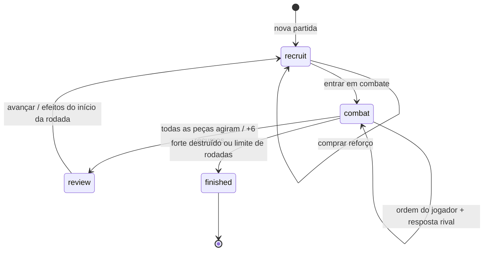

# Fase II: do replay ao jogo por turnos

## Por que esta mudança existe

A proposta original era tomar decisões durante uma batalha tática. A versão
0.2 desenvolveu a simulação e os conceitos de POO, mas a interface web colocava
o jogador como espectador: selecionava estratégias, chamava `BattleEngine.run()`
e reproduzia um resultado já calculado.

A versão 0.3 muda o caminho principal. `TacticalSession` mantém a partida viva
entre chamadas. A página envia um comando, o Python valida e resolve aquela
decisão e a resposta do adversário, e a interface mostra o estado retornado.
Não há resultado futuro escondido nem temporizador decidindo pelo jogador.

## Ciclo da partida



As fases são explícitas e não podem ser puladas pelo JavaScript. Ordens inválidas
não consomem recursos, unidades, ações ou números de identificação.

### 1. Preparação (`recruit`)

- Bases começam com 28 de vida e 10 suprimentos.
- Recrutar desconta recursos imediatamente. A posição pode ser escolhida.
- Limite de oito tropas vivas por lado, sem limite individual por linha.
- O jogador pode poupar, inclusive começar sem recrutar.
- As compras não têm desfazer nesta versão.
- Ao confirmar, o rival escolhe compras considerando o campo atual. Não são
  compras secretas simultâneas; o bot vê sua composição.
- Os estilos `balanced`, `aggressive`, `defensive`, `economy` e `random`
  reutilizam políticas existentes, respeitando o teto de oito tropas.

### 2. Combate (`combat`)

Cada tropa viva tem uma ação. Recrutas podem agir na mesma rodada. O jogador
escolhe a ordem de suas tropas. A seed determina quem abre a primeira rodada
(par: jogador; ímpar: rival); a prioridade se inverte na rodada seguinte.

Depois de uma ordem humana, uma unidade rival responde. Quando um lado não
tem mais peças prontas, o outro conclui as ações restantes. Sem tropas dos dois
lados, a rodada acaba normalmente, sem espera infinita.

| Ordem | Alvo / condição | Consequência |
| --- | --- | --- |
| `attack` | Inimigo alcançável; base apenas sem tropas inimigas | Dano e efeitos da unidade |
| `guard` | A própria peça; Guardião também escolhe aliados | Escudo que reduz o próximo dano em 1 |
| `heal` | Médico, aliado ferido ou ele mesmo | Recupera até 2 HP, sem exceder o máximo |
| `move` | A outra linha | Troca a posição e gasta a ação |
| `wait` | Sem alvo | Abre mão da ação nesta rodada |

O bot usa a unidade pronta mais rápida; ataque desempata a velocidade. Médicos
priorizam cura do aliado com menor proporção de vida. Caso contrário, ele
escolhe o inimigo alcançável com menos HP, ataca a base desprotegida ou espera.
Essa política é compartilhada por todos os estilos de recrutamento. O bot não
planeja movimento nem escolhe proteção nesta primeira versão interativa.

### 3. Revisão (`review`)

Depois da última ação, ambos recebem seis suprimentos. Vida, posição e efeitos
dos sobreviventes persistem. A tela espera o jogador avançar. Somente ao avançar
a rodada muda e os efeitos de início são aplicados; abrir o histórico, mudar
a seleção ou esperar não altera o campo.

### 4. Desfecho (`finished`)

Destruir uma base encerra imediatamente a partida, sem mais respostas do rival.
Ao chegar ao limite (1–50 rodadas), a comparação é: vida das bases, depois dano
de golpes acumulado (sangramento não entra nesse contador, conforme o motor
compartilhado). Igualdade total resulta em empate. A última rodada não paga
renda porque não existe próxima preparação. Comandos de jogo ficam bloqueados;
continuam disponíveis relatório e nova partida.

## Regras compartilhadas e diferenças intencionais

O novo modo reutiliza `Base`, `Troop`, subclasses, `TroopFactory`, custos,
mitigação de dano, cura, efeitos, eventos, estatísticas e snapshots do pacote.
`TacticalSession` compõe `BattleEngine`; os helpers internos de efeitos,
recrutamento e snapshots permanecem dentro do mesmo pacote.

| Assunto | Simulador / laboratório | Sessão interativa |
| --- | --- | --- |
| Execução | Planos simultâneos por rodada, resolvidos por velocidade | Uma unidade por lado alternadamente |
| Identidade das ordens | Índices vinculados às tropas antes das baixas; alvo morto permite nova seleção | Nomes únicos da fábrica, estáveis após baixas |
| Alcance | Conta as fileiras dos dois lados; retaguarda sem frente viva conta como frente | Mesma regra |
| Movimento sem alcance | Avança automaticamente, gastando a ação | Jogador escolhe reposicionar |
| Recarga | Tanque e Médico esperam uma rodada após usar a arma ou curar | Mesma espera; proteger e mover seguem disponíveis |
| Médico / Guardião | Suporte automático antes do ataque | Ordens explícitas do jogador |
| Recrutas | Dependem das ordens no plano daquela rodada | Podem agir imediatamente |
| Limite de tropas | Sem o teto do novo modo | Oito por lado |
| Interface | Replay, velocidade, torneio | Seleção, confirmação de alvo e avanço manual |

No modo interativo, um Tanque que atordoa uma peça ainda pronta consome aquela
ação imediatamente. Se o alvo já agiu, perde a ação da próxima rodada. O efeito
é retirado ao consumir a ação, evitando penalidade duplicada.

Sangramento aplica um de dano nas próximas três viradas de rodada; pode matar
antes do recrutamento. O escudo é consumido pelo próximo dano (inclusive
sangramento, como no modelo existente) ou expira após duas viradas de rodada.
Efeitos remanescentes e baixas são retornados pelo Python.

As métricas de [balanceamento do simulador](balance_notes.md) pertencem à fase
anterior. São referência histórica, não prova de equilíbrio da fase II.

## Contrato entre Python e interface

```python
from battle_simulator.session import TacticalSession

game = TacticalSession(opponent="balanced", seed=0, max_rounds=20)
game.command({"type": "recruit", "kind": "archer", "lane": "back"})
state = game.command({"type": "begin"})

# As opções válidas são calculadas em Python para cada unidade pronta.
actor, choices = next(iter(state["legal_actions"].items()))
state = game.command({"type": "act", "actor": actor, **choices[0]})
```

`state()` inclui fase, rodada, bases, tropas, ações consumidas, ações válidas,
eventos, estatísticas e desfecho. Ler o estado não avança a partida.

`web/playground.py` oferece `new_game`, `game_command` e `game_report`, retornando
JSON. A sessão é única por interpretador/aba. JavaScript monta botões e traduz
eventos. Não reimplementa a validação de combate.

Nomes das unidades funcionam como IDs dentro de uma partida. A fábrica é
compartilhada pelos lados e seus contadores nunca são reutilizados. Seleção
antiga, alvo morto, peça que já agiu ou ordem enviada na fase errada são recusados
antes de alterar o estado.

## Relatórios e reprodução

O simulador mantém seu formato. O novo modo exporta um formato próprio,
identificado por `schema_version: 1`, `mode: interactive` e `ruleset: tactical-v2`,
com configuração, comandos aceitos, estado e snapshots por rodada. `ready_round`
identifica a rodada em que a arma estará disponível; `reload` é a espera da arma.

O identificador anterior `tactical-v1` foi reutilizado por engano até a 0.5.0,
apesar das mudanças de alcance e recarga. Relatórios antigos exigem o código da
versão que os produziu: esse identificador sozinho não distingue suas regras.
Não há migração automática desses relatórios. O simulador agora identifica
suas ordens estáveis como `auto-v2`.

```python
import json
from pathlib import Path
from battle_simulator.session import TacticalSession

report = json.loads(Path("partida.json").read_text(encoding="utf-8"))
assert report["ruleset"] == TacticalSession.ruleset
game = TacticalSession(**report["config"])
for command in report["commands"]:
    game.command(command)
assert game.state() == report["state"]
```

A reprodução depende da mesma versão das regras e configuração, além das
decisões humanas; a seed sozinha não descreve uma partida interativa. A interface
ainda não importa relatórios nem retoma partidas. Recarregar perde a sessão.

## Migração e publicação

1. `web/index.html` passa a ser o jogo. A entrada anterior foi preservada como
   `web/simulator.html`, com navegação de volta ao jogo.
2. `game.js` / `game.css` cuidam da nova experiência; `app.js` / `style.css`
   continuam responsáveis pelo laboratório, com paleta e fontes alinhadas.
3. `tools/build_site.py` monta `_site` localmente e no workflow Pages,
   incluindo `session.py` e os dois pontos de entrada.
4. Os comandos e formatos de relatório da CLI são preservados.
   O `--mode interactive` textual ainda usa o fluxo histórico do simulador.
5. A branch/PR permite revisar a etapa antes do merge. A publicação no GitHub
   Pages ocorre após merge em `main` e sucesso dos testes.

Não há dados de jogadores ou banco de dados para migrar. Uma aba antiga mantém
a execução carregada até ser recarregada. `legacy/` segue intacto como registro
acadêmico.

## Direção visual e verificação

O campo usa pedra, ferro e azul acinzentado, com estandartes azuis e vinho,
figuras vetoriais de corpo inteiro e equipamento por função. A abertura é
recolhida quando o combate começa. Os textos de estado têm contraste com placas
escuras; a disponibilidade de ação e a rodada de recarga aparecem separadamente.

No celular, alvos são botões de confirmação; não é necessário arrastar peças
nem depender de tooltips. Selecionar uma tropa leva aos comandos em telas
estreitas. O histórico fica abaixo do campo.

Validação original da fase II (0.3):

- 57 testes Python, incluindo 25 novos testes da sessão e ponte web.
- Partida completa com o Python real via Pyodide, sem mock do motor.
- Relatório JSON, nova partida, reload e manual.
- Layout em 320, 375, 390, 768, 1024 e 1440 pixels; ordens no layout móvel.
- Simulação automática e torneio executados no laboratório.

O teste está em `tests/browser_smoke.py` e agora roda no CI com Chromium. Não substitui playtests
humanos, auditoria completa com leitor de tela nem testes em Safari/Firefox.
O [roadmap](roadmap.md) separa entregas desta fase das melhorias futuras.

O build gera uma chave de cache pelo conteúdo de todos os recursos web e módulos
Python. As duas páginas e o motor carregado por elas usam a mesma chave; o
rodapé recebe a versão de `pyproject.toml`.
